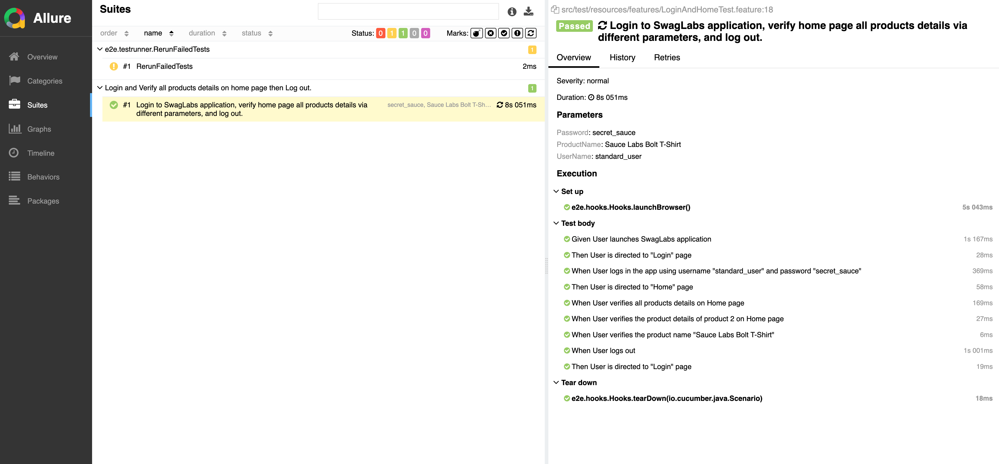
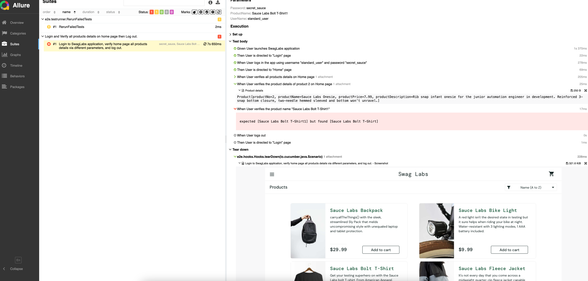
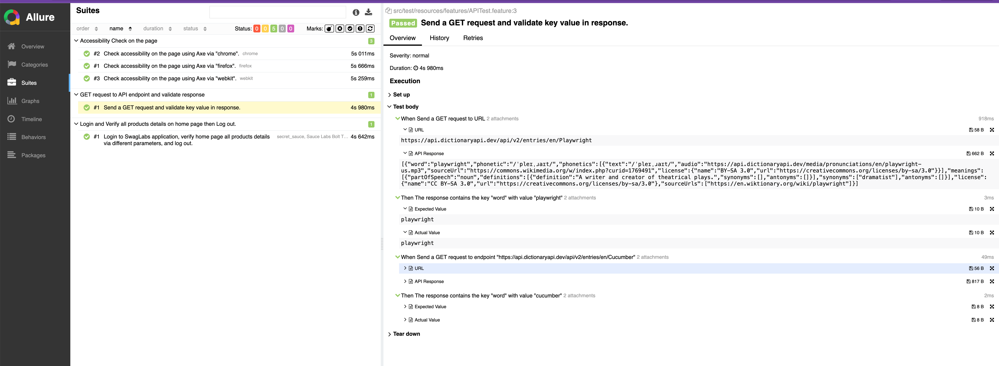
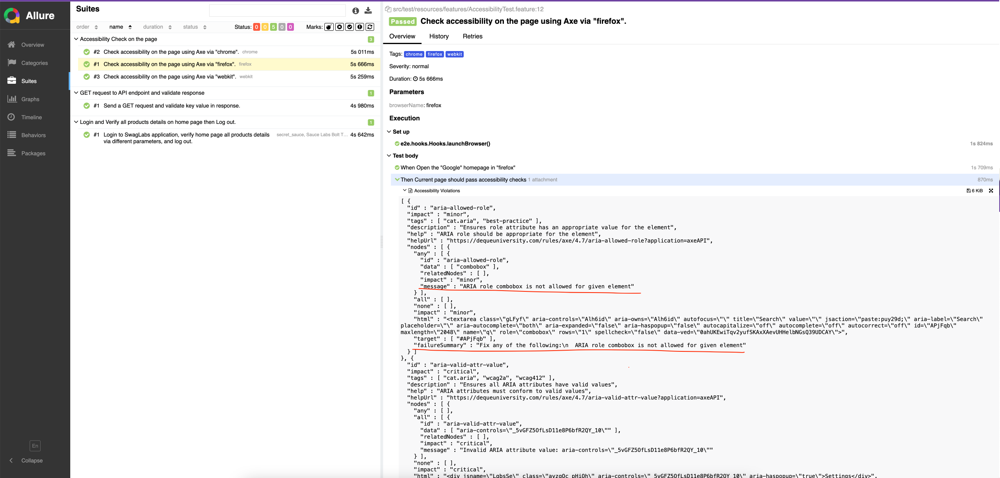

<h1>Automation Framework with Java, Playwright, Cucumber, JUnit5, Maven and Allure</h1>

This is a comprehensive automation framework built using <strong>Java</strong>, <strong>Playwright</strong>, <strong>Maven</strong>, <strong>Cucumber</strong>, <strong>JUnit5</strong>, and <strong>Allure</strong> for end-to-end web testing. The framework is designed to support BDD (Behavior-Driven Development) testing with a focus on modularity, scalability, and easy integration with Continuous Integration (CI) pipelines.

<h2 id="overview">Overview</h2>

This framework is designed to automate functional testing of web applications using the following stack:

<ul>
  <li><strong>Java</strong>: The primary language for writing tests and logic.</li>
  <li><strong>Playwright</strong>: A modern automation tool for testing web applications. It supports multiple browsers (Chromium, Firefox, and WebKit).</li>
  <li><strong>Maven</strong>: The build tool for dependency management and running tests.</li>
  <li><strong>Cucumber</strong>: Provides BDD-style test cases written in Gherkin syntax.</li>
  <li><strong>JUnit5</strong>: A testing framework used to run tests and manage assertions.</li>
  <li><strong>Allure</strong>: A reporting tool to generate test execution reports.</li>
  <li><strong>Git</strong>: Version control for managing the project.</li>
  <li><strong>Notes</strong>: This is still an ongoing project, current purpose is for skills pickup and demonstration. Learn Java Playwright by this project (e2e dir is for automation framework, gettingstarted dir is for Java, Playwright learning), try to cover passing test data via different ways: cucumber step argument, data table, csv file; support dynamic page factory, dynamic getLocators, API verification, Accessibility check, attach test data into allure report for debugging......</li>
</ul>

<h2 id="how-to-run-tests">How to Run Tests</h2>

<h3>1. Run All Tests</h3>

To run all tests with Maven, use the following command:

<pre><code>mvn clean test</code></pre>

This will compile the project, execute the tests, and generate results.

<h3>2. Run Tests with Cucumber</h3>

You can specify which feature files or tags to run using Cucumber's command-line options:

<pre><code>mvn clean test -Dcucumber.options="--tags @smoke"</code></pre>

<h3>3. Run Tests with JUnit5</h3>

To run tests using JUnit5, you can use the Maven Surefire Plugin, which will automatically pick up all test classes annotated with <code>@Test</code> and execute them.

<pre><code>mvn clean test</code></pre>

<h3>4. Run test result report with Allure</h3>

To generate the Allure report, you can use the Maven Allure Plugin, which will automatically pick up all test results to generate the Allure report.

<pre><code>mvn allure:serve target/allure-results </code></pre>

This will open the Allure report in your default browser, showing a detailed view of the test execution, including passed, failed, and skipped tests.

<h2 id="Screenshots">Screenshots</h2>

Please refer to /screenshots/.

### [Passed Allure Result](screenshots/allure-result-1.png)

### [Failed Allure Result](screenshots/allure-result-2.png)

### [Passed Allure Result - API](screenshots/allure-result-3.png)

### [Failed Allure Result - Accessibility Check](screenshots/allure-result-4.png)

